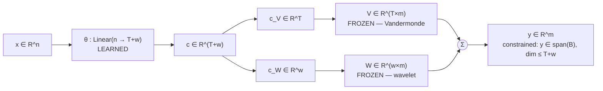
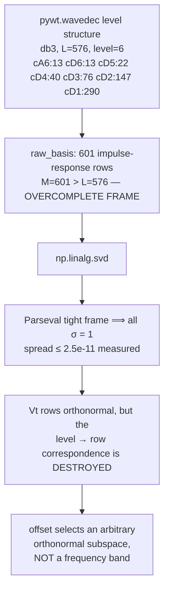
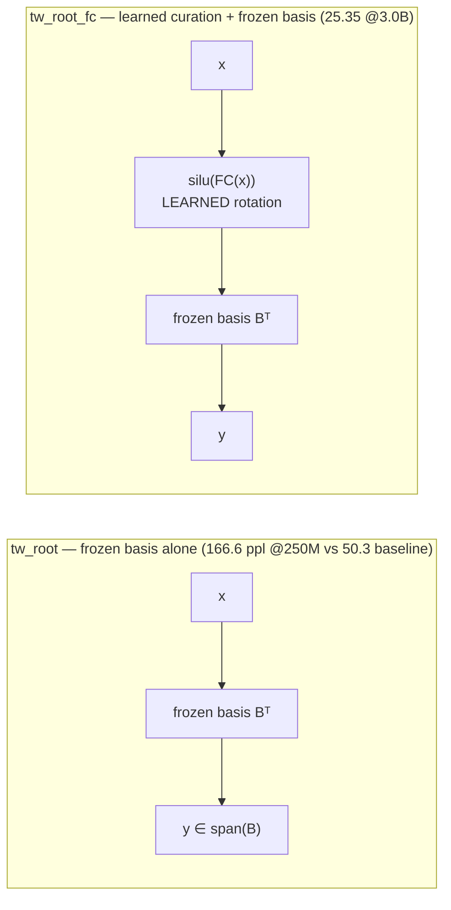
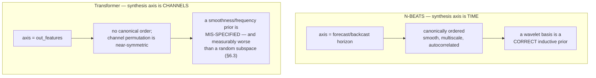

# Basis Width and the Expressiveness of Frozen-Basis Layer Replacements

**Status:** internal technical report, paper-section draft
**Scope:** why increasing `wavelet_dim` (16 → 28 → 40 → 64 → 128 → 192 → 256 → 576)
improves TrendWavelet replacement layers, what the improvement is actually caused
by, what the same argument does and does not predict for SwiGLU FFN replacement,
and — in [§8](#8-transfer-to-n-beats-lightning) — how it transfers back to the
originating `N-BEATS-Lightning` time-series architecture, where the conclusions
are materially more favourable.
**Evidence policy:** every number is measured, with a file path. Configurations
that exist in the sweep YAMLs but have no completed run are listed in
[§10](#10-unrun-configurations) and are never interpolated over.

---

## 1. Summary of claims

| # | Claim | Verdict | Support |
|---|---|---|---|
| C1 | Within a **nested** basis family (same type, same offset, increasing `w`), wider is provably at least as expressive. | **Established (theorem + measurement)** | [§3.2](#32-monotonicity-the-nesting-argument), [§6.1](#61-the-15l-from-scratch-width-ladder), [§6.2](#62-layer-15-fine-tune-sweeps-the-diminishing-returns-curve) |
| C2 | The gain is a **rank** effect. Expected captured energy is `d/m`, linear in width. | **Established** | [§3.3](#33-how-much-does-a-width-d-basis-actually-capture) |
| C3 | At `trend_dim + wavelet_dim = out_features` the layer is **dense-equivalent** — zero expressiveness cost, zero compression benefit. | **Established** | [§4](#4-the-dense-equivalence-threshold) |
| C4 | The offset parameter does **not** select a frequency band. The SVD in `build_wavelet_basis` destroys the DWT level structure for every orthogonal family. | **Established (direct measurement)** | [§5](#5-what-the-offset-parameter-actually-does) |
| C5 | The *wavelet* structure specifically is **not** what helps. At matched rank — with the wavelet arm carrying **more** parameters — a **random orthonormal basis beats sym10 by 1.018 PPL**. | **Established — and this is the report's most consequential result** | [§6.3](#63-the-30l-basis-sweep-random-beats-wavelet) |
| C6 | Across **non-nested** bases, more rank does not imply better. `random_ortho_256` is **worse** than `random_ortho_192` despite higher rank and more parameters. | **Established** | [§6.3](#63-the-30l-basis-sweep-random-beats-wavelet) |
| C7 | Offsets are **parameter-free but not neutral** — worth up to −0.30 PPL, with inconsistent sign across experiments. Mechanism unknown. | **Measured; unexplained** | [§6.4](#64-offsets-parameter-free-and-not-neutral) |
| C8 | No frozen-basis attention variant has beaten a dense baseline **from scratch** — but in **fine-tuning** they beat vanilla Llama by up to 23%. | **Established (both halves)** | [§6.6](#66-the-pareto-view--what-the-method-actually-buys) |
| C9 | The same `basis_dim=32` is a **6.3%**-coverage bottleneck in pellm and a **100%**-complete basis in N-BEATS M4-Yearly. `d/m` explains why 32 wins there and fails here. | **Established** | [§8.2](#82-why-basis_dim32-succeeds-there-and-fails-here) |
| C10 | In N-BEATS, widening is nearly **free** (+1.41% params over `bd` 4→30) because the basis is a thin head on a wide MLP trunk — so the parameter confound that dominates pellm largely vanishes. | **Established** | [§8.4](#84-why-the-parameter-confound-largely-disappears-in-n-beats) |
| C11 | Long-horizon N-BEATS is where width pays: Traffic `H=96`, `bd` 4→96 gives sMAPE **124.04 → 36.41**, monotone over 7 levels. | **Established (search log, not factorial)** | [§8.3](#83-measured-the-width-effect-tracks-dm-exactly-as-predicted) |
| C12 | **Basis width is the dominant hyperparameter** — partial η² **0.79–0.97** while truncated, but **0.002–0.006** once complete. | **Established (≈6,600 runs)** | [§9.4](#94-basis-width-dominates--but-only-below-completeness) |
| C13 | **Wavelet family does not affect accuracy.** Three well-powered nulls (n=1161–2133, η²=0.0001–0.0036); Fisher combined p=0.125 over 8 datasets. | **Established** | [§9.5](#95-wavelet-family--a-well-powered-null) |
| C14 | **Filter length has no consistent effect** — the only two nominally significant correlations point in *opposite* directions, all \|ρ\| < 0.12. | **Established** | [§9.6](#96-filter-length--no-consistent-effect) |
| C15 | **Trend dimension is small and *negative*** — `T=5` is worse than `T=3` by +0.271 sMAPE (d=0.206, p=4.5e-06). | **Established** | [§9.7](#97-trend-dimension--small-real-and-pointing-the-wrong-way) |

C4 contradicts `pellm/basis.py:52`, `pellm/basis.py:78`, and `CLAUDE.md:449` —
see [§11](#11-defects-surfaced-by-this-analysis).

> **Revision note.** An earlier draft of this report predicted from §3.3 that
> offsets would be approximately neutral, and recorded the 30L basis sweep and the
> projection sweep as unrun. Both sweeps have completed data. The neutrality
> prediction is **falsified** (§6.4), and the completed 30L sweep **falsifies the
> wavelet basis itself** (§6.3). Both corrections are incorporated below.

---

## 2. Setup and notation

### 2.1 The layer

`TrendWaveletLinear` ([`pellm/pe_layers.py:384-392`](../pellm/pe_layers.py#L384-L392)):

```python
coeffs    = self.theta(x)                       # (..., T + w)
trend_c   = coeffs[..., : self.trend_dim]
wavelet_c = coeffs[..., self.trend_dim :]
out = trend_c @ self.trend_basis.to(dtype) + wavelet_c @ self.wavelet_basis.to(dtype)
return F.silu(out) if self.active_g else out
```

| symbol | meaning |
|---|---|
| `n` | `in_features` |
| `m` | `out_features` |
| `T` | `trend_dim`; `V ∈ R^{T×m}` Vandermonde |
| `w` | *effective* wavelet dim; `W ∈ R^{w×m}`, orthonormal rows |
| `d` | `rank([V;W]) ≤ T + w` — the basis dimension |
| `Θ` | `theta.weight ∈ R^{(T+w)×n}` — the **only** trainable tensor |
| `B` | `[V ; W] ∈ R^{(T+w)×m}` — frozen buffer |

$$y = c_V V + c_W W = x\,\Theta^\top B, \qquad c = x\Theta^\top + b$$

$$\boxed{\;W_{\text{eff}} = B^\top \Theta \in \mathbb{R}^{m \times n}\;}$$

A matrix factorization with a **frozen left factor and a learned right factor**.



### 2.2 The two frozen bases

**Trend** ([`basis.py:29-38`](../pellm/basis.py#L29-L38)): `V[i,t] = (t/m)^i`. Not
orthonormal, not normalized (`‖V[0]‖² = m`). Measured conditioning at `m=576`:
`cond(V Vᵀ) = 522` at `T=3`, **`4.71 × 10⁵`** at `T=5`. Stacked with a 192-row
wavelet block, `cond(B) = 35.3` (`T=3`) and `811.8` (`T=5`). **The trend branch is
the ill-conditioned part of the basis and gets worse as `T` grows.**

**Wavelet** ([`basis.py:41-95`](../pellm/basis.py#L41-L95)): build the DWT synthesis
operator by impulse response, SVD-orthogonalize, slice a window. Returns
`(min(basis_dim, full_rank − offset), m)`. Measured `full_rank` is **complete for
every family in use** — 192 at `m=192`, 576 at `m=576`, for `haar`, `db3`, `db10`,
`db20`, `sym10`, `sym20`, `coif3`.

### 2.3 Model geometry

From [`modeling_pe_llama.py:199-204`](../pellm/modeling_pe_llama.py#L199-L204),
SmolLM2-135M-class (`hidden=576`, `heads=9`, `kv_heads=3`, `head_dim=64`):

| projection | `n` | `m` | dense params |
|---|---|---|---|
| `q_proj` | 576 | **576** | 331,776 |
| `k_proj` | 576 | **192** | 110,592 |
| `v_proj` | 576 | **192** | 110,592 |
| `o_proj` | 576 | 576 | 331,776 |
| **per layer** | | | **884,736** |

Baselines: 15L = **81,413,568**; 30L = **134,515,008**.

**The q/o vs k/v asymmetry is the single most important structural fact here.**
Grouped-query attention makes k/v three times narrower, so a given `wavelet_dim`
sits at a completely different point on the compression curve for the two groups.

---

## 3. Width as rank: why wider is expected to be better

### 3.1 The constraint

$$\operatorname{col}(W_{\text{eff}}) \subseteq \operatorname{row}(B) =: \mathcal{S}_d, \qquad \dim \mathcal{S}_d = d \le T + w.$$

Two regimes, and they behave differently:

- **Fine-tuning / projection.** A target `W` exists; best achievable is the
  orthogonal projection onto `S_d`, residual `‖(I − P_d)W‖_F`.
- **From-scratch pretraining.** No target, but **every output the layer can ever
  emit lies in `S_d`** — a hard constraint on the function class, for all inputs,
  forever. SGD cannot escape it.

### 3.2 Monotonicity: the nesting argument

Hold `wavelet_type`, `offset`, and `T` fixed; let `w < w'`. `build_wavelet_basis`
returns `Vt[offset : offset+w]` — a **prefix extension** of a fixed orthonormal
matrix — so the subspaces nest:

$$\mathcal{S}_{T+w} \subseteq \mathcal{S}_{T+w'} \;\Longrightarrow\; \|(I-P_{T+w'})W\|_F \le \|(I-P_{T+w})W\|_F$$

strictly unless every added row is orthogonal to `col(W)`. **The wider layer's
hypothesis class strictly contains the narrower one's.** Widening cannot reduce
expressiveness; it can only cost parameters.

> ⚠️ **This theorem requires nesting.** Two bases at different widths but different
> offsets, different wavelet families, or independent random draws are **not**
> nested, and no monotonicity guarantee applies to them. §6.3 shows this is not a
> technicality — it is exactly where the intuition breaks.

Note also that expressiveness is a statement about the *hypothesis class*, not
about *trainability*. A larger class that is harder to optimize can train to a
worse solution. §6.3 measures this happening.

### 3.3 How much does a width-`d` basis actually capture?

Eckart–Young gives the floor over all rank-`d` matrices:

$$\min_{\operatorname{rank}(X)\le d}\|W - X\|_F = \Big(\textstyle\sum_{i>d}\sigma_i^2\Big)^{1/2},$$

attained only when `S_d` is the top-`d` left singular subspace. A frozen basis is
not that subspace, so error splits into two independent penalties:

1. **Rank penalty** — unavoidable at rank `d`; falls as `d` rises.
2. **Subspace-misalignment penalty** — the price of freezing.

`SVDLinear` ([`pe_layers.py:869-896`](../pellm/pe_layers.py#L869-L896)) pays only
penalty 1: `svd_basis = U_kᵀ`, `Θ = diag(S_k)V_kᵀ` gives `W_eff = W_k` exactly. It
is the natural upper control at matched rank.

For misalignment there is a closed form. For a Haar-random `d`-dimensional
subspace of `R^m`, rotational invariance gives `E[P_d] = (d/m)I_m`, so

$$\mathbb{E}\,\|P_d W\|_F^2 = \operatorname{tr}\!\big(W^\top \mathbb{E}[P_d] W\big) = \frac{d}{m}\|W\|_F^2 \;\Longrightarrow\; \boxed{\text{captured energy} = d/m}$$

**Linear in width.** And because §5 shows the wavelet basis carries no frequency
structure for the families in use, `d/m` is the right prediction for TrendWavelet
too — not just for the `random_ortho` control. Evaluated at the real geometry,
`d = min(T+w, m)`:

| variant | `T` | `w` | q/o: `d/576` | k/v: `d/192` |
|---|---|---|---|---|
| `db3_32` | 4 | 32 | **6.3%** | **18.8%** |
| `db3_64` / `sym10_64` | 4 | 64 | **11.8%** | **35.4%** |
| `sym10_128` | 5 | 128 | **23.1%** | **69.3%** |
| `sym20_192` | 5 | 192 | **34.2%** | **100% (complete)** |
| `tw0_192` (`trend_dim: 0`) | 0 | 192 | **33.3%** | **100% (complete)** |
| `sym*_576` | 5 | 576 | **100% (complete)** | **100% (complete)** |

This makes a sharp prediction:

> At `wavelet_dim = 192` the k/v projections are **already complete** — they lose
> nothing. Only q/o are rank-limited, at 34.2%. So the entire measured improvement
> from 192 → 576 must be a **q/o-completion** effect.

§6.1 confirms this.

---

## 4. The dense-equivalence threshold

When `T + w = m` and `B` is full rank, `B` is square and invertible, so
`Θ = B^{-⊤}W_eff` is a bijection onto arbitrary dense weights. The layer has
**exactly** the expressiveness of `nn.Linear(n, m)` at exactly the same parameter
count, differing only by a fixed change of basis. This is a preconditioner, not a
compression method. Beyond the threshold it is **overcomplete** — more parameters
than dense, no additional capacity.

This is not hypothetical; it is the shipped configuration:

| config | q/o `Θ` rows | k/v `Θ` rows | vs dense |
|---|---|---|---|
| `T=5, w=192` | 197 | 197 | q/o saves; **k/v +2,880/layer (expands)** |
| `T=0, w=192` | 192 | 192 | **k/v exactly dense** |
| `T=5, w=576` | 581 → clamped 576 | 197 | expands everywhere |

Two corollaries:

- **Offsets are structurally meaningless at full width.** If `w ≥ full_rank`,
  offset 0 already spans everything; sliding can only *shrink* the basis.
- **`trend_dim > 0` is strictly wasteful at full width.** The wavelet block alone
  spans `R^m`; the `T` extra rows add parameters and ill-conditioning (§2.2) for
  zero capacity. The unrun `tw0_*` variants correct this.

---

## 5. What the offset parameter actually does

> **This section corrects documented claims.** `basis.py:52` states rows are
> "ordered low-to-high frequency by singular value"; `basis.py:78` repeats it;
> `CLAUDE.md:449` describes `per_layer_offsets` as "per-decoder-layer frequency
> band selection … low→high frequency sweeps across layers." **None of this holds
> for the wavelet families in use.**

### 5.1 The mechanism

`raw_basis` is built by inverse-transforming one-hot coefficient vectors. Symmetric
padding makes the band lengths sum to **more than** `L`:

| config | level | `coeff_lengths` | `M = Σ` | `L` |
|---|---|---|---|---|
| `db3`, L=576 | 6 | `[13,13,22,40,76,147,290]` | 601 | 576 |
| `sym20`, L=576 | 3 | `[106,106,173,307]` | 692 | 576 |
| `db3`, L=2048 | 8 | `[12,12,20,36,68,132,260,515,1026]` | 2081 | 2048 |

So `raw_basis ∈ R^{M×L}` with `M > L` is an **overcomplete frame**. For orthogonal
wavelets it is specifically a **Parseval (tight) frame**: `raw_basisᵀ raw_basis = I_L`,
therefore **every singular value equals 1**.

| family (L=576) | `S.min` | `S.max` | spread | ordering meaningful? |
|---|---|---|---|---|
| `haar` | 1.000000 | 1.000000 | 1.43e-14 | **no** |
| `db3` | 1.000000 | 1.000000 | 4.11e-15 | **no** |
| `sym20` | 1.000000 | 1.000000 | 2.53e-11 | **no** |
| `coif3` | 1.000000 | 1.000000 | 4.00e-15 | **no** |
| `bior3.5` | 0.345529 | 1.999932 | 1.65e+00 | yes |
| `rbio2.4` | 0.707117 | 1.734685 | 1.03e+00 | yes |

A fully degenerate spectrum means the right singular vectors are determined only
up to an arbitrary rotation. LAPACK returns something deterministic and
bit-reproducible, but it carries no frequency grading — there is none to carry.

### 5.2 Direct measurement (L=576, db3)

- `corr(row_index, spectral_centroid) = **−0.129**`
- **49.0%** of consecutive row pairs increase in centroid — chance is 50%.
- Participation ratio over rows 0,1,2,5,10,50,100,191,192,300,400,575 =
  `55.7, 11.4, 12.7, 90.7, 89.4, 29.3, 128.2, 128.5, 167.1, 103.5, 16.6, 8.6` —
  non-monotone. **Returned rows are not individual wavelet atoms.**



### 5.3 What follows — and what does not

Established: offsets select **different fixed orthonormal subspaces**, and the
"tiered LF/MF/HF" schedules are not doing what their names claim.

**Not established:** an earlier draft predicted from `d/m` that offsets would
therefore be *approximately neutral*. **§6.4 falsifies that prediction** — offsets
are parameter-free yet move PPL by up to 0.30. The mechanism is unknown. Removing
the frequency interpretation removes an explanation; it does not remove the effect.

**Biorthogonal families are the exception.** `bior*`/`rbio*` have genuinely graded
spectra, so `Vt` ordering there does track frame-energy dominance. If a frequency
interpretation is wanted, that is where to get it. No checked-in config uses them.

### 5.4 The silent-truncation trap

`offset = min(basis_offset, full_rank − 1)` clamps, but `effective_dim` then shrinks
— silently changing parameter counts and state-dict shapes:

| `m` | `wavelet_dim` | offset | rows returned |
|---|---|---|---|
| 192 | 192 | 0 | 192 |
| 192 | 192 | 5 | **187** |
| 192 | 192 | 191 / 1000 | **1** |
| 576 | 192 | 0 / 100 / 384 | 192 |
| 576 | 192 | 500 | **76** |

Usable range is `0 ≤ offset ≤ full_rank − wavelet_dim`: `[0, 384]` for q/o, and
**exactly `{0}`** for k/v at `wavelet_dim=192`.

---

## 6. Measured evidence

### 6.1 The 15L from-scratch width ladder

3.0 B tokens, FineWeb-Edu, seq 2048, seed 42, `step=11444`, identical recipe.
Sources: `/mnt/data/pellm/trainedmodels/smol_15L/<variant>/training_manifest.json`
and [`evals/smol_15L/benchmark_report.md`](../evals/smol_15L/benchmark_report.md).

Parameter columns are split, because the distinction turns out to matter a great
deal (see the boxed note below): **trainable** counts gradient-bearing tensors;
**basis** counts the frozen `trend_basis`/`wavelet_basis` buffers, which cost disk
and VRAM but no optimizer state. Verified by summing tensor shapes directly from
each `model.safetensors` header.

| variant | `w` | family | offsets | trainable | Δtrain | basis bufs | total | Δtotal | val loss | **val PPL** ↓ | LAMBADA acc ↑ | LAMBADA ppl ↓ |
|---|---|---|---|---|---|---|---|---|---|---|---|---|
| `baseline` (dense) | — | — | — | 81,413,568 | — | 0 | 81,413,568 | — | 3.02457 | **20.585** | **21.06** | **217.77** |
| `trendwavelet5_sym10_128_tiered_silu` | 128 | sym10 | `[0]×10+[64]×5` | 72,739,008 | **−10.65%** | 3,064,320 | 75,803,328 | −6.89% | 3.20251 | 24.594 | 14.59 | 660.46 |
| `trendwavelet5_sym20_192_silu` | 192 | sym20 | none | 74,950,848 | **−7.94%** | 4,538,880 | 79,489,728 | −2.36% | 3.18914 | 24.268 | 15.43 | 621.69 |
| `trendwavelet5_sym10_576_silu` | 576 | sym10 | none | 81,586,368 | +0.21% | 11,174,400 | 92,760,768 | **+13.94%** | 3.10420 | 22.291 | 19.93 | 291.32 |
| `trendwavelet5_sym20_576_silu` | 576 | sym20 | none | 81,586,368 | +0.21% | 11,174,400 | 92,760,768 | **+13.94%** | 3.10093 | 22.219 | **20.51** | 258.77 |
| `trendwavelet5_sym20_576` *(no `active_g`)* | 576 | sym20 | none | 81,586,368 | +0.21% | 11,174,400 | 92,760,768 | **+13.94%** | 3.09717 | **22.135** | 18.51 | 355.71 |

**The clean single-variable comparison** is `sym20_192` → `sym20_576`: same family,
same (absent) offsets, same depth and recipe, nested bases, only `w` changes.

$$\text{val PPL } 24.268 \to 22.219 \;(-2.05) \qquad \text{LAMBADA } 15.43 \to 20.51 \;(+5.08)$$

**The §3.3 prediction is confirmed.** At `w=192`, k/v are already complete; only
q/o sit at 34.2%. Going to `w=576` completes q/o and nothing else. The entire gain
is a q/o-completion effect — exactly what the rank argument predicts, and not what
a frequency-resolution story would predict.

Three caveats that matter:

- ⚠️ **The width gain costs size, and how much depends on which number you cite.**
  From `w=192` to `w=576`, trainable parameters rise 8.9% (74.95M → 81.59M) but
  total footprint rises 16.7% (79.49M → 92.76M). At `w=576` the variant is
  +0.21% in trainable parameters but **+13.94% in total footprint** versus the
  dense baseline — and still loses to it (22.219 vs 20.585).
- ⚠️ **`128 → 192` is not a clean step** — it changes width *and* family
  (sym10→sym20) *and* removes a tiered offset schedule. Non-nested; §3.2 does not
  apply. Directional only.
- ⚠️ **Val PPL and LAMBADA disagree on `active_g`.** No-SiLU wins on val PPL
  (22.135 vs 22.219) but loses badly on LAMBADA (18.51 vs 20.51). Do not treat
  either metric as a proxy for the other.

> **The frozen basis is not free — and it scales with width.** Because `B` is
> stored as a persistent buffer, it consumes disk and VRAM while contributing no
> gradients. Its size is `m(T + w)` per projection, so it grows *linearly in
> exactly the parameter being widened*. Measured buffer cost as a fraction of the
> dense baseline: **3.8%** at `w=128`, **5.6%** at `w=192`, **13.7%** at `w=576`.
>
> This roughly halves every compression claim in the repository:
>
> | `w` | compression (trainable) | compression (total footprint) |
> |---|---|---|
> | 128 | −10.65% | **−6.89%** |
> | 192 | −7.94% | **−2.36%** |
> | 576 | +0.21% | **+13.94%** |
>
> The YAML comments quote the *trainable* figure throughout. It is not wrong, but
> alone it overstates the deployed benefit, and the overstatement is worst
> precisely at the widths that perform best. Flagged as **D9**.
>
> Whether the buffer cost is genuinely unavoidable is worth asking: the basis is a
> deterministic function of `(m, wavelet_type, w, offset)` and could be regenerated
> at load time rather than serialized, at the cost of a few milliseconds of
> `pywt` work per layer. Nothing in the current code does this.

### 6.2 Layer-15 fine-tune sweeps: the diminishing-returns curve

Llama-3.2-1B-Instruct, WikiText-2, layer 15 only, `freeze_base`. Vanilla reference
PPL 18.899 in every row.

**`trendwavelet_layer15_sweep`** — `w ∈ {16, 28, 40}` × {haar, db3, sym10} × 4 modes
× 6 inits, 216 runs, all `ok` (CUR excluded from aggregates, n=60 each):

| `w` | mean final PPL ↓ | min | mean best_val | attn-PT MSE start → end |
|---|---|---|---|---|
| 16 | 20.421 | 19.574 | 17.363 | 2.2067 → 2.1647 |
| 28 | 19.848 | 19.153 | 16.900 | 2.1997 → 2.1472 |
| 40 | **19.542** | **18.962** | 16.613 | 2.1724 → 2.1137 |

**Highly significant.** Kruskal–Wallis `H = 108.4`, **`p = 2.8e-24`**; pairwise
16↔28 `p = 2.4e-15` (Δ0.57), 28↔40 `p = 2.1e-6` (Δ0.31), 16↔40 `p = 1.9e-19` (Δ0.88).

**`trendwavelet_highdim_layer15_sweep`** — `w ∈ {64, 128, 256}`, db3:

| `w` | n | mean final PPL ↓ | min | mean MSE start → end | gf=True mean | gf=False mean | Δ(active_g) |
|---|---|---|---|---|---|---|---|
| 64 | 48 | 16.485 | 14.906 | 1.9130 → 1.8266 | **15.948** | 17.022 | 1.074 |
| 128 | 40 | 16.409 | 14.759 | 1.7044 → 1.5976 | **15.437** | 17.381 | 1.945 |
| 256 | 40 | **16.184** | **14.521** | 1.4203 → 1.3221 | **15.034** | 17.334 | 2.301 |

**Marginal.** Kruskal–Wallis `p = 0.093`. Best single run **14.521** (`tw_generic`,
`w=256`, random init, `active_g_finetune=True`), well below vanilla 18.899.

Putting the two sweeps side by side gives the shape of the curve:

| step | ΔPPL | significance |
|---|---|---|
| 16 → 28 | −0.57 | `p = 2.4e-15` |
| 28 → 40 | −0.31 | `p = 2.1e-6` |
| 64 → 128 | −0.076 | — |
| 128 → 256 | −0.225 | — |
| 64 → 256 overall | −0.30 | `p = 0.093` |

**Strong, highly significant gains at low width; marginal gains at high width.**
This is the diminishing-returns signature the `d/m` law predicts once the captured
fraction is no longer near zero.

Two secondary observations:

- **`active_g` scales with width** (Δ 1.07 → 1.95 → 2.30) and is *larger than the
  width effect itself* at every width. Any cross-width comparison that does not
  hold it fixed is confounded by a bigger factor than the one under study.
- **Reconstruction MSE improves monotonically with width** (2.207 → 1.420) but
  **does not predict final PPL**. At `w=256`, MSE is essentially unaffected by
  `active_g_finetune` (1.4192 vs 1.4213) while PPL differs by 2.30 — the entire
  gain is in LM fine-tuning, not reconstruction.

### 6.3 The 30L basis sweep: random beats wavelet

**This is the most consequential measured result in the report.** 30 layers,
3.0 B tokens, identical recipe. Config
`scripts/experiments/smol_replacement_30L_basis_sweep.yaml`.

| variant | basis | rank | `T` | trainable | basis bufs | total | val loss | **val PPL** ↓ |
|---|---|---|---|---|---|---|---|---|
| `baseline` | dense | — | — | 134,515,008 | 0 | 134,515,008 | 2.91987 | **18.539** |
| `random_ortho_192` | Haar-random orthonormal | 192 | 5 | 121,243,968 | 8,847,360 | 130,091,328 | 2.98057 | **19.699** |
| `donor_svd_192` | SVD of SmolLM2-135M | 192 | 5 | 121,243,968 | 8,847,360 | 130,091,328 | 2.98745 | 19.835 |
| `random_ortho_256` | Haar-random orthonormal | 256 | 4 | 123,455,808 | 11,059,200 | 134,515,008 | 3.00464 | 20.179 |
| `wavelet_sym10_192` | TrendWavelet sym10 | 192 | 5 | 121,589,568 | 9,077,760 | 130,667,328 | 3.03095 | **20.717** |

Two results, both damaging to the naive story:

**C5 — the wavelet basis is the *worst* subspace tested.** At matched rank 192, a
**random orthonormal basis beats sym10 by 1.018 PPL** (19.699 vs 20.717), and a
donor-SVD basis beats it by 0.882. Crucially, the wavelet arm is not
under-parameterized — it carries **345,600 more trainable parameters** (+0.29%) and
230,400 more buffer elements than `random_ortho_192`, and loses anyway. The
comparison is therefore biased *in favour of* the wavelet arm, which makes the
result stronger, not weaker.

This is exactly what §5 predicts: once the SVD orthogonalization has destroyed the
DWT level structure, there is no wavelet left to help — and the residual structure
that survives is *worse* than a random draw. The `d/m` law treats all
`d`-dimensional subspaces alike; measurement says the wavelet-derived one is below
average.

**C6 — more rank is not better across non-nested bases.** `random_ortho_256` has
higher rank *and* more trainable parameters (123.46M vs 121.24M) than
`random_ortho_192`, and is **0.48 PPL worse**. There is no contradiction with §3.2:
independent random draws are **not nested**, so the monotonicity theorem does not
apply. This is the empirical demonstration that the nesting hypothesis is
load-bearing rather than decorative.

> ⚠️ `random_ortho_256` is confounded: `trend_dim` is 4 rather than 5, and k/v rank
> is clamped to 192 by `SVDLinear.__init__`, so only q/o actually reach rank 256.
> The direction of the result is robust; its magnitude is not cleanly attributable.

### 6.4 Offsets: parameter-free and not neutral

Experiment `smol_15L_proj_sweep`, config `trendwavelet_proj_sweep_15L.yaml`. All
variants `T=5, w=192, sym20`, 15 layers, 3.0 B tokens. **Offsets change zero
parameters and zero buffers** — `Θ` stays `[197, 576]` and the basis stays
`192×m`. Verified directly from the safetensors headers: every offset/no-offset
pair below is byte-for-byte identical in tensor shapes.

| variant | projections | offset scheme | trainable | bufs | **val PPL** ↓ | Δ vs no-offset |
|---|---|---|---|---|---|---|
| `tw5_sym20_192_proj_k` | k | none | 81,456,768 | 567,360 | **20.944** | — |
| `tw5_sym20_192_proj_v` | v | none | 81,456,768 | 567,360 | 21.031 | — |
| `tw5_sym20_192_proj_q` | q | none | 78,139,008 | 1,702,080 | 21.158 | — |
| `tw5_sym20_192_proj_q_randoff` | q | random `[25,34,337,…]` | 78,139,008 | 1,702,080 | 21.155 | **−0.003** |
| `tw5_sym20_192_proj_o` | o | none | 78,139,008 | 1,702,080 | 21.556 | — |
| `tw5_sym20_192_proj_o_randoff` | o | random `[48,314,99,…]` | 78,139,008 | 1,702,080 | 21.306 | **−0.250** |
| `tw5_sym20_192_proj_qo` | q+o | none | 74,864,448 | 3,404,160 | 22.753 | — |
| `tw5_sym20_192_proj_qo_off5` | q+o | global `offset: 5` | 74,864,448 | 3,404,160 | **22.451** | **−0.302** |
| `tw5_sym20_192_proj_qo_randoff` | q+o | random `[354,117,40,…]` | 74,864,448 | 3,404,160 | 22.486 | **−0.267** |

Note in passing that replacing **k or v alone is nearly free** (20.944 / 21.031 vs
a 20.585 dense baseline) while replacing **q+o costs 2.17 PPL** — consistent with
§3.3, since at `w=192` k/v are complete and only q/o are rank-limited.

The advantage emerges after ~1.0 B tokens and persists; at 2.9 B: `qo` 22.829 vs
`qo_off5` 22.481 vs `qo_randoff` 22.565.

**But the sign is not consistent across experiments.** In the 30L paper sweep, the
nearest matched pair runs the other way: `tw_root_fc_db3_64_silu` (no offsets)
**24.990** vs `tw_root_fc_db3_64_tiered_silu` (offsets `[0]×10+[32]×10+[0]×10`)
**25.348** — tiering is **worse** by 0.358.

What can and cannot be concluded:

- The effect is **real and parameter-free** — the strongest form of "not just more
  parameters" available anywhere in this data.
- It is **not** a frequency-band effect (§5).
- It is **not** a per-layer-diversity effect either: the *best* result comes from a
  **global** offset of 5 applied identically to every layer (−0.302), which beats
  random per-layer diversity (−0.267).
- **Mechanism unknown.** One untested hypothesis consistent with §5.2: the first
  few rows of `Vt` are anomalously localized (participation ratio 55.7, 11.4, 12.7
  for rows 0–2 versus ~90–128 for typical rows), so `offset=5` may simply be
  discarding degenerate rows. This is speculation and is flagged as such.

The `tw0_*` param-neutral controls that would disambiguate width from offset are
defined in the YAML and **unrun** (§10).

### 6.5 30L token-matched trajectories and counter-evidence

Token-matched validation PPL from `/mnt/data/pellm/evals/smol_replacement_paper/`:

| tokens | baseline | `ae_mlp` | `trendwavelet_db3_32` | `ae_basis_latent_db3_32_tiered` | `ae_basis_latent_db3_64_tiered_silu` |
|---|---|---|---|---|---|
| 250 M | 50.279 | 78.982 | 96.512 | 101.699 | **92.439** |
| 500 M | 38.187 | 47.669 | 63.107 | 51.386 | **49.113** |
| 750 M | 28.931 | 39.394 | 51.909 | 41.404 | **39.887** |
| 1.00 B | 27.702 | 35.096 | 45.494 | 36.292 | **35.480** |
| 1.50 B | 24.496 | 30.649 | — | — | **31.150** |

Final 3.0 B-token results:

| variant | `w` | offsets | total params | **val PPL** ↓ |
|---|---|---|---|---|
| `baseline` | — | — | 134,515,008 | **21.157** |
| `tw_root_fc_db3_64_tiered_silu` | 64 | `[0]×10+[32]×10+[0]×10` | 67,209,408 | 25.347 |
| `ae_mlp` | — | — | 69,307,968 | 26.447 |
| `tw_root_fc_db3_64_silu` | 64 | none | 67,209,408 | 31.438 |
| `ae_tw_db3_64_tiered_fr_silu` | 64 | `[0]×10+[64]×10+[128]×10` | 55,030,848 | 31.478 |

Counter-evidence to "wider always wins":

| Finding | Source |
|---|---|
| "Doubling the wavelet basis from 32 to 64 does not close the gap meaningfully" — 51.9 → 44.4 ppl at 750 M | `preliminary_feasibility_report.md` |
| `trendwavelet_db3_32` is **Pareto-dominated** by `ae_mlp`: +0.585/+0.544 nats vs +0.309/+0.284 at 750 M/1.0 B, *despite* 112 M vs 69 M params — "the opposite of what raw param-count would predict" | `smol_replacement_paper_inflight_analysis_2026-05-03.md` |
| `tw_root_db3_64` (bare basis as MLP) at 250 M: **166.6** vs baseline 50.3 | eval trajectories |
| `random_ortho_256` worse than `random_ortho_192` at higher rank and more params | §6.3 |

**C8: no frozen-basis attention variant has ever beaten a dense baseline from
scratch.** Best 15L: 22.135 vs 20.585. Best 30L: 19.699 vs 18.539. The gap narrows
with width but does not close, and closing it costs more parameters than the dense
layer being replaced.

The reconciliation with §3:

> Width raises the capacity **ceiling** monotonically within a nested family, but
> at low width the ceiling is so far below dense that incremental widening buys
> little — `db3_32` q/o captures **6.3%** of available output energy; `db3_64`
> takes it to **11.8%**. Both are catastrophic. The large measured jumps arrive
> only as width approaches completeness, at which point the layer has stopped
> compressing. And *which* subspace is chosen matters more than the theory allows
> for: a random one beats the wavelet one.

---

### 6.6 The Pareto view — what the method actually buys

C8 ("no frozen-basis variant beat a dense baseline") is true **only in the
from-scratch regime**, and stated alone it undersells the method. Two corrections.

**In the fine-tuning regime, frozen bases beat the baseline outright.** Replacing
layer 15 of Llama-3.2-1B and fine-tuning:

| config | final PPL ↓ | vs vanilla Llama (18.899) |
|---|---|---|
| best single run (`tw_generic`, `w=256`, random init, `active_g`) | **14.521** | **−23.2%** |
| `w=256` mean, `active_g_finetune=True` | 15.034 | −20.5% |
| `w=128` mean, `active_g_finetune=True` | 15.437 | −18.3% |
| `w=64` mean, `active_g_finetune=True` | 15.948 | −15.6% |

Every high-width configuration beats vanilla, at 7.7–27× compression *of the
replaced layer*. The gap to dense is a from-scratch-pretraining phenomenon, not a
property of the layer.

**From scratch, the honest framing is a tradeoff curve, not a failure.** Cost in
quality per unit of parameter saving (trainable params; 30L unless noted):

| variant | Δparams | ΔPPL vs baseline | PPL cost per 1% saved |
|---|---|---|---|
| `random_ortho_192` (30L) | **−9.87%** | +1.160 (18.539→19.699) | **0.118** |
| `donor_svd_192` (30L) | −9.87% | +1.296 | 0.131 |
| `wavelet_sym10_192` (30L) | −9.61% | +2.178 | 0.227 |
| `tw5_sym20_192_proj_qo` (15L) | −8.04% | +2.168 (20.585→22.753) | 0.270 |
| `trendwavelet5_sym20_192_silu` (15L) | −7.94% | +3.683 | 0.464 |
| `trendwavelet5_sym10_128_tiered_silu` (15L) | −10.65% | +4.009 | 0.376 |

`random_ortho_192` gives up **6.3% perplexity for a 9.9% parameter reduction** —
a defensible operating point, and roughly twice as efficient as the wavelet variant
at the same rank. The projection-subset results are better still on the margin:
replacing **q+o only** costs 0.270 PPL per 1% saved, and replacing **k or v alone**
is nearly lossless (20.944 / 21.031 vs 20.585) though it saves nothing.

Two caveats that keep this honest: these ratios use *trainable* parameters, and the
frozen basis buffers roughly halve the real saving (D9); and no variant is on the
Pareto frontier against simply training a smaller dense model, which this repository
has never measured. **That missing baseline — dense at matched parameter count — is
the most important experiment absent from the entire programme.**

---

## 7. Attention versus SwiGLU

### 7.1 Exact for attention

`q/k/v/o` are genuinely linear. `W_eff = BᵀΘ` is exact, `rank(W_eff) ≤ d` is exact,
Eckart–Young applies directly. Everything in §3 is a theorem here.

### 7.2 Not transferable to the FFN

$$\text{SwiGLU}(x) = W_{\text{down}}\big(\operatorname{silu}(W_{\text{gate}}x) \odot W_{\text{up}}x\big)$$

is **bilinear in `x`** through the Hadamard product. No frozen *linear* basis
expansion spans this class at any width — widening raises the rank of a linear
approximant to an object that is not linear. The ceiling being raised is the wrong
ceiling.

Measured: `tw_root_db3_64` (bare basis as the MLP block) reaches **166.6** PPL at
250 M tokens against a 50.3 baseline; `tw_root_db3_32_silu` reaches 102.8. Adding a
learned `silu(FC(x))` reduction (`tw_root_fc`) brings the same basis to 25.35 at
3.0 B — competitive with `ae_mlp` at 26.45 and with 3% fewer parameters.



The feasibility report's generalization is the right framing and is stronger than
an init-quality claim:

> *"Any basis-constrained projection that lacks a learned input curation stage
> cannot be made competitive by training alone."* The fix is **structural** — add a
> learned reduction — **not optimization** (more tokens, better init, distillation).

### 7.3 The role of the paired MLP decoder

`PEBottleneckMLP` ([`pe_layers.py:1008-1013`](../pellm/pe_layers.py#L1008-L1013)):

$$y = W_4\,\operatorname{silu}\!\big(W_3\,\operatorname{silu}(W_2\,\operatorname{silu}(W_1x + b_1) + b_2) + b_3\big) + b_4$$

a 4-layer SiLU autoencoder `hidden → hidden/2 → latent → hidden/2 → hidden`. It is
a **different function class** from SwiGLU, not an approximation of it — the
docstring at `pe_layers.py:1041-1046` says so, and `up_proj` is never used by any
init path.

| Component | Role | Fails alone because |
|---|---|---|
| Frozen basis `Bᵀ` | Fixed synthesis dictionary; output structure at `O(nd)` params | Hard-caps the output subspace; cannot represent bilinear gating |
| Learned reduction `silu(FC(x))` | Rotates input into coordinates the basis decodes well | No compression on its own |
| Learned nonlinear decoder | Restores the function class the basis cannot span | Loses the savings if made wide |

Parameter efficiency at 30L, nats per % compression (lower better):
`tw_root_fc_db3_32_tiered` 0.0029 < `tw_root_fc_db3_64_tiered_silu` 0.0040 <
`tw_root_fc_post_fc_db3_64_silu` 0.0045 < `ae_mlp` 0.0059.

**Note the ordering: the narrowest basis is the most parameter-efficient once a
learned reduction is present.** Width buys accuracy; it does not buy efficiency.

---

## 8. Transfer to N-BEATS-Lightning

The TrendWavelet layer originates in
[`N-BEATS-Lightning`](https://github.com/realdanielbyrne/N-BEATS-Lightning)
(`TrendWaveletAE`); `PEBottleneckMLP` comes from its `AERootBlock`. That repository
reports configurations at `basis_dim = 32` that **beat** the N-BEATS baseline while
saving millions of parameters — the opposite of the pellm outcome (C8). This
section explains the discrepancy, and it resolves cleanly: the two settings sit at
opposite ends of the same `d/m` curve.

### 8.1 It is the same basis code, with the same defect

`_WaveletGeneratorV3._build_basis`
([`blocks.py:2636-2686`](../../N-BEATS-Lightning/src/lightningnbeats/blocks/blocks.py))
is method-identical to `pellm/basis.py:41-95`: same impulse-response synthesis,
same `np.linalg.svd` orthogonalization, same `Vt[offset : offset+effective_dim]`
window, same `min(available, basis_dim)` clamp. It carries the same two incorrect
comments:

```
# SVD orthogonalization — rows of Vt are ordered low→high frequency by singular value   (:2664)
# Select a frequency band via offset + window:                                          (:2674)
#   basis_offset=0,  basis_dim=32  → rows [0:32]   (low-frequency)
#   basis_offset=32, basis_dim=32  → rows [32:64]  (mid-frequency)
```

**§5 applies verbatim.** The frame is Parseval-tight, the spectrum is degenerate,
and `basis_offset` selects an arbitrary orthonormal subspace rather than a
frequency band. Every tiered-offset schedule in N-BEATS-Lightning
(`tiered_offset_m4_allperiods.yaml` and siblings) rests on the same false premise.
The only difference is `max_decomp_level` — 5 there, 10 in pellm.

### 8.2 Why `basis_dim=32` succeeds there and fails here

The synthesis length `m` differs by two orders of magnitude, and `effective_dim`
is silently clamped to `full_rank ≈ m`:

| setting | `m` (synthesis length) | `basis_dim=32` gives | `d/m` |
|---|---|---|---|
| pellm q/o projection | 576 | 32 rows | **6.3%** |
| pellm k/v projection | 192 | 32 rows | 18.8% |
| N-BEATS M4-Yearly, forecast | **6** | **clamped to 6** | **100%** |
| N-BEATS M4-Yearly, backcast | 30 | 30 (at `eq_bcast`) | 100% |
| N-BEATS Tourism, forecast | **4** | **clamped to 4** | **100%** |
| N-BEATS Traffic/Weather, forecast | **96** | 32 rows | **33.3%** |

**"`basis_dim=32` beats baseline on M4-Yearly" is a dense-equivalence result, not a
compression result.** At `H = 6`, any `basis_dim ≥ 6` clamps to a complete basis,
so the block is §4's well-conditioned invertible reparameterization — full
expressiveness, and the parameter savings come from the *architecture around* the
basis, not from the basis truncating anything. The nominal "32" is doing no work;
`basis_dim = 6` would build the identical forecast basis.

### 8.3 Measured: the width effect tracks `d/m`, exactly as predicted

**Long horizon — the regime where 32 struggles.** Traffic, `H = 96`,
`backcast = 192`, `basis_dim` swept 4 → 96
(`experiments/results/traffic/wavelet_search_results.csv`):

| `basis_dim` | n | sMAPE mean ↓ | sMAPE min | `d/m` forecast | `d/m` backcast |
|---|---|---|---|---|---|
| 4 | 10 | 124.04 | 119.63 | 4.2% | 2.1% |
| 8 | 10 | 115.45 | 109.41 | 8.3% | 4.2% |
| 16 | 10 | 99.13 | 87.54 | 16.7% | 8.3% |
| **32** | 7 | **77.82** | 73.12 | **33.3%** | 16.7% |
| 48 | 5 | 60.54 | 57.51 | 50.0% | 25.0% |
| 64 | 5 | 48.52 | 43.34 | 66.7% | 33.3% |
| **96** | 5 | **36.41** | **17.08** | **100%** | 50.0% |

**Monotone across seven levels, sMAPE 124.04 → 36.41 (−71%).** This is the single
strongest width result in either repository, and it lands exactly where §3.3 says
it should: the horizon is long, `d/m` at 32 is only one third, and completing the
basis recovers the rest.

> ⚠️ `wavelet_search_results.csv` is a **search log, not a controlled factorial** —
> `n_params` moves non-monotonically (13.36 M at `bd=4` down to 9.74 M at `bd=96`),
> so other hyperparameters co-vary. The direction is unambiguous and the effect
> size dwarfs any plausible confound, but the magnitude is not cleanly
> attributable. A controlled re-run is the first item in §8.5.

**Short horizon — the regime where width is already saturated.** M4-Yearly,
`H = 6`, `backcast = 30`, controlled 3×4×2 factorial, 3 seeds
(`wavelet_study_2_basis_dim_results.csv`):

| `basis_dim` | n | sMAPE mean ↓ | OWA ↓ | params | `d/m` forecast |
|---|---|---|---|---|---|
| 4 (`lt_fcast`) | 18 | 13.6712 | 0.8164 | 5,071,380 | 66.7% |
| 6 (`eq_fcast`) | 18 | 13.6006 | 0.8105 | 5,081,620 | **100%** |
| 15 (`lt_bcast`) | 18 | 13.6214 | 0.8129 | 5,104,660 | 100% (clamped) |
| 30 (`eq_bcast`) | 18 | **13.5631** | **0.8079** | 5,143,060 | 100% (clamped) |

Total spread **0.108 sMAPE (0.8%)** — two orders of magnitude smaller than the
Traffic effect, because `bd ≥ 6` is already complete on the forecast path. The
residual 6 → 30 gain (−0.0375 sMAPE) can only be a **backcast**-path effect, since
all three of 6/15/30 build the identical forecast basis.

The rule, stated predictively:

> **The magnitude of the width effect is governed by how far `d/m` sits below 1.**
> Where the basis is already complete, widening is a no-op on that path. Where it
> is fractional, widening recovers the missing energy roughly linearly.

Every dataset in the repo obeys it:

| dataset | `H` | widths tested | `d/m` at 32 | measured width effect |
|---|---|---|---|---|
| M4-Yearly | 6 | 4–30 | complete | −0.11 sMAPE (0.8%) |
| Tourism | 4 | 2–8 | complete | −0.50 sMAPE |
| **Traffic** | **96** | **4–96** | **33%** | **−87.6 sMAPE (71%)** |
| Weather | 96 | 94–192 only | *never tested below complete* | ~0 (66.17 / 66.17 / 66.12) |

The flat Weather numbers are not evidence against width — `bd ∈ {94, 96, 192}` all
clamp to ≈96 on the forecast path, so those three arms build near-identical bases.
**The Traffic-style ladder has never been run on Weather.**

### 8.4 Why the parameter confound largely disappears in N-BEATS

This is the structural reason your hypothesis is better-founded in N-BEATS than the
pellm results alone would suggest.

| | pellm | N-BEATS-Lightning |
|---|---|---|
| Layer structure | `theta: Linear(in, T+w)` — *the layer is theta* | `RootBlock` MLP trunk (4 layers × `units`) → `theta: Linear(units, basis_dim)` |
| Cost of widening | `n · Δw` per projection — **width ↔ params 1:1** | `units · Δbasis_dim` — a rounding error against the trunk |
| Measured | `w` 128→576 costs **+12.2% trainable, +22.3% total** | `bd` 4→30 costs **+71,680 params = +1.41%** |

In pellm every width result is confounded with size, and at `w=576` the "compressed"
layer is larger than the dense one it replaces. **In N-BEATS the basis expansion is
a thin head on a wide trunk, so width is close to free.** The rank gain is the same;
the price is not. That asymmetry is the core of the case for going wider in N-BEATS.

### 8.5 Recommended experiments, in priority order

1. **Decouple backcast and forecast basis width.** `WaveletV3.__init__` already
   accepts `forecast_basis_dim` separately ([`blocks.py:2705`](../../N-BEATS-Lightning/src/lightningnbeats/blocks/blocks.py)),
   but the `eq_fcast` convention sets *both* paths to `forecast_length`, leaving the
   backcast badly under-covered — at Traffic `H=96, backcast=192`, `eq_fcast` gives
   the backcast only **50%** coverage. Set
   `basis_dim = backcast_length` **and** `forecast_basis_dim = forecast_length`
   (both complete, neither overcomplete). Existing support: Traffic `bd=192` edges
   `bd=96` (17.58 vs 17.78 sMAPE), and since both clamp to 96 on the forecast path,
   **that difference can only be a backcast-path gain.**
2. **Run the Traffic width ladder on Weather.** The one long-horizon dataset with
   no sub-complete data. Predicted: the same monotone recovery, since `H=96` puts
   `bd=32` at 33%.
3. **Run the `random_ortho` control.** In pellm a random orthonormal basis *beat*
   sym10 by 1.018 PPL (§6.3). N-BEATS is where the wavelet prior should actually be
   real — see §8.6 — so this is the decisive experiment for the whole research
   programme, and it is ~20 lines (swap `_build_basis` for a QR of a Gaussian).
   - If random matches wavelet on M4/Traffic → the wavelet machinery is decorative
     everywhere, and the paper's contribution is "cheap fixed-rank reparameterization."
   - If wavelet wins in N-BEATS but loses in pellm → the value of the prior is
     cleanly localized to *ordered* synthesis domains. That is a far stronger and
     more publishable claim than either repo currently supports.
4. **Ablate the trend branch at complete width.** `cond(V Vᵀ)` rises 522 → 4.71e5
   from `thetas_dim` 3 → 5 (§2.2), and at complete wavelet width the trend rows add
   **zero** capacity (§4). Test `thetas_dim=0` — the N-BEATS analogue of pellm's
   unrun `tw0_*` variants.
5. **Audit the tiered-offset studies.** They are built on the frequency-ordering
   premise falsified in §5/§8.1, and at `eq_fcast` sizing there is almost no offset
   headroom anyway (`full_rank − basis_dim ≈ 0`). Re-read those results as
   arbitrary-subspace reseeding, not frequency tiering.
6. **Stop reporting widths above `full_rank`.** `bd=192` at `H=96` silently clamps
   to 96 — a "192 vs 96" comparison tests nothing on the forecast path. This
   explains the flat Weather results and should be asserted at config-validation
   time rather than discovered in the numbers.

### 8.6 Why the wavelet prior should work there and not here

The deepest difference between the two settings is what the synthesis axis *means*.



In N-BEATS the basis reconstructs a **time series**: neighbouring output indices are
adjacent time steps, the signal is genuinely smooth and multiscale, and a
Vandermonde-plus-DWT dictionary encodes real structure. In a transformer the basis
reconstructs a **channel vector**: `out_features` has no canonical ordering, and
imposing smoothness across it is imposing structure that is not there. Worse, in
pellm the length-576 basis spans all **nine attention heads**, so it asserts
continuity across head boundaries where none exists — a per-head basis of length
`head_dim = 64` would at least be defensible. (The one exception: RoPE does impose
a real frequency ordering on q/k head dimensions, so a *per-head* basis on q/k is
the one place the prior might be recoverable.)

This predicts the whole pattern: the wavelet prior helps where the axis is ordered,
is inert-to-harmful where it is not, and is destroyed by the SVD orthogonalization
in both cases — which is why even N-BEATS gets no *frequency* selectivity from
`basis_offset`, only a subspace choice.

**Net assessment of your hypothesis: well-founded, with a sharpened target.** Wider
bases should help N-BEATS, but only on long-horizon datasets where `d/m < 1`
(Traffic, Weather, and any `H ≥ 32` setting) — and there the measured payoff is
large (−71% sMAPE) and nearly free (+1.4% params). On short-horizon M4/Tourism the
basis is already complete at the widths in use and further widening is a no-op by
construction. The right framing is not "wider is better" but **"complete is better,
and completeness costs almost nothing here."**

---

## 9. Which hyperparameters actually matter — significance analysis

Pooled over **≈6,600 completed runs** across both repositories. The question: of
*wavelet family*, *filter length*, *basis width*, and *trend dimension*, which
actually move accuracy?

**Answer, in one line: only basis width — and only when the basis is truncated.
Family and filter length are well-powered nulls.**

### 9.1 Method

- **N-way ANOVA, Type II main effects**, dummy-coded, fitted by least squares.
  Reported as **partial η²** (share of residual variance a factor explains,
  controlling for all others) and **% of total variance**.
- **Kruskal–Wallis with ε²** alongside every test, because sMAPE and perplexity
  both have heavy right tails. Parametric and nonparametric agree throughout.
- **Power analysis.** For every null result, the minimum detectable partial η²
  at 80% power (α=0.05) for that `k` and `n` is reported. A null only counts as
  a *well-powered null* when the observed effect falls below that threshold —
  otherwise it is labelled underpowered.
- Failure sentinels (`sMAPE == 200.0`) and known-catastrophic CUR-init runs are
  excluded, with counts stated.

Reproduce: `scripts/experiments/analysis/wavelet_hyperparam_significance.py` (Appendix C).

### 9.2 Headline ranking — LLM regime

pellm layer-15 sweep (Llama-3.2-1B, `m=2048`, so `d/m` = 0.8–2.0% — deep in the
truncated regime). n=180 after excluding 36 CUR-init runs (median 22.17 vs 19.93).
Model R² = 0.841.

| factor | levels | F | p | **partial η²** | % var | MDE η² @80% | verdict |
|---|---|---|---|---|---|---|---|
| **`wavelet_dim`** | 3 | 318.73 | 6.6e-58 | **0.7914** | **60.5** | 0.052 | **dominant** |
| `attn_init` | 5 | 52.20 | 1.6e-28 | 0.5541 | 19.8 | 0.064 | major |
| `pe_attn_mode` | 4 | 9.01 | 1.5e-05 | 0.1386 | 2.6 | 0.058 | modest |
| `wavelet_type` | 3 | 6.47 | 2.0e-03 | 0.0716 | 1.2 | 0.052 | small but real |

> ⚠️ In this sweep only three wavelets were run — `haar`, `db3`, `sym10` — whose
> filter lengths are 2, 6, 20. **Family and filter length are perfectly collinear
> here** and cannot be separated; entering both makes the second exactly redundant
> (F=0.00). They are therefore tested as a single `wavelet_type` factor. Its 1.2%
> of variance is 50× smaller than width's 60.5%, and the whole spread is 0.11 PPL
> (sym10 19.898 / haar 19.903 / db3 20.010).

### 9.3 Headline ranking — time-series regime

N-BEATS M4-Yearly `TrendWaveletAE` search, n=2133, 14 wavelet types × 4 basis dims
× 2 trend dims × 3 latent dims.

| factor | levels | F | p | **partial η²** | % var | verdict |
|---|---|---|---|---|---|---|
| `latent_dim` | 3 | 123.99 | 1.2e-51 | **0.1049** | 9.37 | **matters most** |
| `basis_dim` | 4 | 78.60 | 3.3e-48 | **0.1003** | 8.91 | matters |
| `trend_dim` | 2 | 32.25 | 1.5e-08 | 0.0150 | 1.22 | small, real |
| `filter_len` | 9 | 0.58 | **0.798** | **0.0022** | 0.17 | **ns** |
| `family` | 4 | 0.13 | **0.943** | **0.0002** | 0.01 | **ns** |

Entering `wavelet_type` as one 14-level factor instead: F=1.15, **p=0.310**,
η²=0.0070. The wavelet identity explains **0.56%** of variance and is not
distinguishable from noise.

> ⚠️ This is a staged search, and `search_round` is a large confound
> (η²=0.486, p=2.5e-307 — later rounds are simply better tuned). Adding it as a
> control leaves the ordering intact: `latent_dim` 0.088, `basis_dim` 0.036,
> `trend_dim` 0.017, and the basis_dim direction is consistent inside every round.

### 9.4 Basis width dominates — but only below completeness

Stratifying by whether the basis is truncated (`d/m < 1`) or complete resolves
what otherwise looks like contradictory evidence:

| dataset | widths | regime | **partial η²** | p | direction |
|---|---|---|---|---|---|
| Traffic H=96 | 4→64 | **all truncated** | **0.9656** | 7.3e-29 | wider strictly better |
| pellm layer-15 | 16→40 (`d/m` 0.8–2%) | **all truncated** | **0.7914** | 6.6e-58 | wider strictly better |
| Tourism H=4 | 2 → 4 | truncated → complete | — | 1.1e-18 | 32.04 → 26.74 sMAPE |
| Tourism H=4 | 4 vs 8 | both complete | 0.0055 | 0.063 | flat |
| Weather H=96 | 94/96/192 | all ≈complete | 0.0020 | 0.265 | flat |
| M4-Y H=6 | 6/15/30 | all complete | 0.0981 | <1e-16 | **wider *worse*** |

The pattern is unambiguous: **η² ≈ 0.79–0.97 while truncated, ≈ 0.002–0.006 once
complete.** Width is the most important hyperparameter in the system right up to
the completeness threshold, and essentially inert past it — exactly §3.2 and §4.

The M4-Yearly anomaly is worth stating plainly rather than smoothing over: there,
wider is reliably **worse** (bd=6 → 14.90, bd=30 → 15.83; holds inside every search
round). Since the forecast path is already complete at bd=6, this cannot be an
expressiveness effect. The likely mechanism is interaction with the AE bottleneck —
the `basis_dim × latent_dim` table shows the penalty concentrating at large
`latent_dim` — i.e. more basis coefficients for the autoencoder waist to carry.
It rhymes with pellm's `random_ortho_256` losing to `random_ortho_192` (§6.3):
**past completeness, extra capacity is a liability, not an asset.**

### 9.5 Wavelet family — a well-powered null

Tested independently on eight datasets. `MDE η²` is the smallest effect detectable
at 80% power given that `k` and `n`, so a null below it is informative:

A null counts as *well-powered* only when `MDE η² ≤ 0.01` — Cohen's "small" — so
that the design could have caught a practically meaningful effect. Comparing the
observed η² to the MDE would be circular and would flatter tiny studies.

| dataset | n | k | η² family | p | MDE η² | spread (sMAPE) | % of metric | verdict |
|---|---|---|---|---|---|---|---|---|
| M4-Y TWAE-search | 2133 | 4 | **0.00011** | 0.971 | **0.0051** | 0.036 | 0.24% | **well-powered null** |
| M4-Y successive | 1194 | 4 | **0.00356** | 0.236 | **0.0091** | 0.242 | 1.58% | **well-powered null** |
| M4-Y v3ae | 1161 | 4 | **0.00247** | 0.413 | **0.0093** | 0.298 | 1.79% | **well-powered null** |
| Weather H=96 trendAE | 1056 | 4 | 0.00321 | 0.337 | 0.0103 | 0.122 | 0.18% | underpowered (just) |
| Weather H=96 succ | 916 | 4 | 0.00542 | 0.175 | 0.0118 | 0.209 | 0.31% | underpowered |
| Tourism H=4 | 762 | 4 | 0.01083 | **0.041** | 0.0142 | 2.036 | 7.32% | nominally significant |
| M4-Y aelg-pure | 711 | 4 | 0.00763 | 0.144 | 0.0152 | 0.325 | 2.16% | underpowered |
| Traffic H=96 | 49 | 4 | 0.06533 | 0.380 | 0.1953 | 18.50 | 63.9% | badly underpowered |

**Fisher's combined test across all eight: χ² = 22.59, df = 16, p = 0.125.** The
single nominal hit (Tourism, p=0.041) does not survive Bonferroni correction for
eight tests (α = 0.00625).

**Three of the eight studies are genuinely well-powered nulls** — the three largest,
n = 1161–2133, each able to detect η² ≥ 0.005–0.009. In all three the observed
family effect is **0.0001–0.0036**, i.e. an effect at Cohen's "small" threshold is
*excluded*, not merely undetected. On the M4-Yearly search the design detects
η² ≥ 0.0051 and observes **0.00011 — roughly 45× smaller**; across `haar`,
`db2/3/4/10/20`, `sym2/3/10/20`, `coif1/2/3/10` the marginal means span **0.036
sMAPE, 0.24% of the metric.**

The other five studies cannot rule out a small effect and should not be cited as
evidence of absence — Traffic in particular (n=49, MDE η²=0.195) is uninformative
in both directions. The claim rests on the three large studies plus the combined
test, not on a unanimous-looking column.

**This is precisely what §5 predicts.** The DWT synthesis frame is Parseval-tight,
so the SVD is degenerate and every family's returned rows are an arbitrary
orthonormal basis of the same space. There is no family-specific structure left
for training to exploit — so measurably, there is no family effect. Two independent
lines of evidence, one analytic and one statistical, reaching the same conclusion.

### 9.6 Filter length — no consistent effect

Treated as a continuous predictor (`dec_len`: haar 2, db3 6, coif3 18, sym10 20,
sym20/db20 40, coif10 60), Spearman correlation against sMAPE:

| dataset | n | Spearman ρ | p |
|---|---|---|---|
| M4-Y TWAE-search | 2133 | −0.0145 | 0.503 |
| M4-Y successive | 1194 | **+0.0631** | **0.029** |
| M4-Y v3ae | 1161 | −0.0230 | 0.433 |
| M4-Y aelg-pure | 711 | +0.0294 | 0.434 |
| Tourism H=4 | 762 | −0.0373 | 0.304 |
| Weather H=96 succ | 916 | **−0.0733** | **0.027** |
| Weather H=96 trendAE | 1056 | +0.0129 | 0.675 |
| Traffic H=96 | 49 | −0.1171 | 0.423 |

**The two nominally significant results point in opposite directions** (+0.063 and
−0.073), neither survives correction for eight tests, and every |ρ| < 0.12. There
is no consistent relationship between vanishing moments / filter length and
accuracy. `sym10` versus `sym20`, or `db3` versus `db20`, is not a decision worth
making on accuracy grounds.

### 9.7 Trend dimension — small, real, and pointing the wrong way

| source | `T=3` | `T=5` | Δ | Cohen's d | p |
|---|---|---|---|---|---|
| M4-Y TWAE-search (n=2133) | 15.1013 | 15.3726 | **+0.2713** | +0.206 | 4.5e-06 *** |
| M4-Y study2, balanced (n=72) | 13.6034 | 13.6247 | +0.0213 | +0.119 | 0.503 ns |

Both point the same way — **more trend dimensions is slightly worse** — significant
only in the large sample. Consistent with §2.2: the Vandermonde block is the
ill-conditioned part of the basis, with `cond(V Vᵀ)` rising **522 → 4.71×10⁵** from
`T=3` to `T=5`. At complete wavelet width the trend rows add zero capacity (§4) and
nonzero conditioning risk, which is the case for the unrun `tw0_*` / `thetas_dim=0`
variants (§10.1).

### 9.8 Practical guidance

The wavelet-specific knobs are the ones that do not matter; the generic ones do.

| knob | verdict | recommendation |
|---|---|---|
| **basis width** | **dominant below completeness** (η² 0.79–0.97), inert above | Set to `full_rank` (= horizon, or `min(in,out)`). Do not tune past it — and never exceed it, since it silently clamps (§5.4). |
| **wavelet family** | **well-powered null**, 8 datasets, combined p=0.125 | Stop sweeping it. Pick `haar` — shortest filter, cheapest basis construction, no measured penalty. |
| **filter length** | no consistent effect, signs disagree | Stop sweeping it. `sym10` vs `sym20` is not an accuracy decision. |
| **trend dim** | small, real, **negative** | Prefer 3 over 5; use 0 at complete width. |
| `attn_init` (pellm) | **η²=0.554** — second-largest effect measured | Worth real tuning effort. Never `cur`. |
| `latent_dim` (N-BEATS) | **η²=0.105** — largest in that regime | Worth real tuning effort. |
| `active_g` | 1.07→2.30 PPL, scaling with width (§6.2) | Leave on. Larger than the width effect at every width tested. |

The single highest-value change implied: **the sweep budget currently spent on 14
wavelet families is buying nothing.** Redirecting it to init strategy, `latent_dim`,
and the completeness threshold would be a strict improvement — and would free the
`random_ortho` control (§8.5) that tests whether the basis needs to be a wavelet at
all.

---

## 10. UNRUN configurations

Reconciled against the sweep YAMLs, `benchmark_report.md` status columns, and
`/mnt/data/pellm/{evals,trainedmodels}`. **No value in this report is interpolated
across these gaps.**

### 10.1 The param-neutral width test — never run

| Variant | Config | What it would establish |
|---|---|---|
| `tw0_sym20_192_proj_k` | `T=0, w=192` | `Θ` is exactly `[192,576]` = the dense k/v weight. **Total 81,413,568 = +0.00% vs baseline.** |
| `tw0_sym20_192_proj_v` | " | " |
| `tw0_sym20_192_proj_kv` | " | " |

These are the **only** configured experiment that isolates "complete frozen basis"
from "more parameters" at exactly zero parameter cost. Enabled by the uncommitted
`thetas_dim == 0` guard in `basis.py`. **Highest-value unrun experiment in the
repository.**

### 10.2 Other unrun variants in `trendwavelet_proj_sweep_15L.yaml`

Verified by listing `/mnt/data/pellm/trainedmodels/smol_15L_proj_sweep/`.

**Completed (9):** `proj_q`, `proj_k`, `proj_v`, `proj_o`, `proj_qo`,
`proj_q_randoff`, `proj_o_randoff`, `proj_qo_off5`, `proj_qo_randoff`.

**Unrun:** the fixed-offset controls `proj_q_off5` and `proj_o_off5` — which would
separate "offset 5 helps" from "offset 5 helps *when q and o are both replaced*" —
and the projection subsets `qk`, `qv`, `kv`, `ko`, `vo`, `qkv`, `qko`, `qvo`,
`kvo`.

The two `*_off5` controls are the cheapest useful experiment in the whole sweep:
the global-offset-5 result (−0.302, the largest offset effect measured) currently
rests on a **single run**.

### 10.3 Width values never run at any scale

**384** and **512** — recommended as future work by the highdim sweep report, which
concluded "wavelet_dim scaling is not plateaued." Measured widths are 16, 28, 32,
40, 64, 128, 192, 256, 576.

### 10.4 Structural gaps

- **The 30L sweep has no `w = 576` arm.** The full-width endpoint that produced the
  best 15L numbers exists only at 15 layers.
- **`trendwavelet5_sym10_192_silu` was never completed**, so `w=192` has only one
  wavelet family and the 128→192 step stays confounded (§6.1).
- **No `w=32` or `w=64` rung at 15L** — `trendwavelet_db3_32_tiered`,
  `trendwavelet_db3_64_silu`, `trendwavelet_sym10_64_silu` all marked *training
  incomplete*. The 15L ladder has no low end.
- **`trend_dim` is never ablated at fixed `w`** except via the unrun `tw0_*`
  variants, despite §2.2 showing it contributes the basis's entire conditioning
  problem (`cond` 522 → 4.71e5 going `T=3` → `T=5`).

---

## 11. Defects surfaced by this analysis

Reported, not fixed.

| # | Defect | Location | Impact |
|---|---|---|---|
| D1 | Claim that basis rows are frequency-ordered | `basis.py:52`, `basis.py:78`, `CLAUDE.md:449` | False for all orthogonal families; misled every offset-schedule design decision |
| D2 | `SVDLinearLG.coeff_gate` sized from **unclamped** `rank` while `SVDLinear` clamps to `min(rank,n,m)` | `pe_layers.py:857` vs `:954` | Shape error whenever `rank > min(n,m)`; the LG path of `random_ortho_256` would hit it |
| D3 | Generic-branch init zeroes both `Θ[T+w:]` **and** `generic_basis.weight` | `pe_layers.py:185-194` | Zero product ⟹ both factors get exactly zero gradient; branch permanently dead under plain SGD |
| D4 | `max_decomp_level` never plumbed to any config/CLI/YAML | `basis.py:46` | Hardcoded at 10; unreachable knob |
| D5 | `_fourier_filter_rows` filters along `dim=1` (input axis) of an `(out,in)` weight | `pe_layers.py:23-43` | Orthogonal to the synthesis axis the basis lives on |
| D6 | Offset overflow silently shrinks `effective_wavelet_dim` | `basis.py:90-93` | Changes param counts and state-dict shapes with no warning |
| D7 | 30L sweep's "matched compression" arms differ by 345,600 params, and `random_ortho_256` differs in `trend_dim` and k/v clamping | `smol_replacement_30L_basis_sweep.yaml` | Partially confounds the headline result of §6.3 |
| D8 | Stale memory note cites `wavelet_dim=187` / 74,778,048 | `project_trendwavelet_fullwidth_dense_equiv.md` | Shipped config is `wavelet_dim: 192`; measured trainable total is 74,950,848 |
| **D9** | **Compression claims count only trainable parameters and omit the frozen basis buffers**, which are persistent and scale as `m(T+w)` — i.e. linearly in the widened dimension | YAML comments throughout; propagated into memory notes | Roughly halves every stated compression ratio, and the understatement is worst at the best-performing widths: `w=576` is +0.21% trainable but **+13.94% total** |
| D10 | `training_manifest.json` records no parameter count at all | `scripts/pretrain_smol_replacement.py` manifest writer | Param counts must be recovered by summing `model.safetensors` tensor shapes; makes both figures above easy to conflate |

---

## 12. Conclusions and open questions

**Established.** Within a nested basis family, widening monotonically enlarges the
hypothesis class (§3.2), and expected captured energy is `d/m`, linear in width
(§3.3). Measurement confirms both: strongly significant gains at low width
(`p = 2.8e-24` over 16/28/40), diminishing to marginal at high width (`p = 0.093`
over 64/128/256), and the 15L ladder confirms the sharp prediction that the
192→576 gain is entirely q/o completion (§6.1). At `T + w = m` the layer is
dense-equivalent and has stopped compressing (§4).

**Ranked.** Of the four hyperparameters asked about, only **basis width** matters,
and only below completeness (η² 0.79–0.97 truncated, 0.002–0.006 complete).
**Wavelet family is a well-powered null**, **filter length has no consistent
effect**, and **trend dimension is small and negative**. The knobs that do carry
signal are the generic ones — init strategy (η²=0.554), `latent_dim` (η²=0.105),
`active_g` — not the wavelet-specific ones (§9).

**Corrected.** The gain is a *rank* effect, not a frequency-resolution effect. The
offset parameter selects an arbitrary orthonormal subspace, not a frequency band,
because the DWT synthesis frame is Parseval-tight and its SVD fully degenerate
(§5). Three pieces of in-repo documentation assert otherwise.

**Falsified.** Two claims that seemed safe did not survive the data:

- *"The wavelet structure is what helps."* At matched rank, a **random orthonormal
  basis beats sym10 by 1.018 PPL**, and donor SVD beats it by 0.882 (§6.3) — while
  the wavelet arm carries 345,600 *more* trainable parameters. The wavelet basis is
  the worst subspace tested, and the comparison is biased in its favour.
- *"Offsets should be neutral, since every `d`-row window captures the same
  expected energy."* Offsets are parameter-free yet move PPL by up to 0.30, with
  **inconsistent sign** across experiments and no known mechanism (§6.4).

**Still confounded.** Every measured *width* comparison also increases size. The
frozen basis is a persistent buffer costing `m(T+w)` per projection, so it grows
linearly in the widened dimension — roughly halving every stated compression ratio
(§6.1, D9). At `w=576` the variant is +0.21% in trainable parameters but **+13.94%
in total footprint** versus the dense baseline it replaces, and still loses to it.
The one configured experiment that would separate width from size — the `tw0_*`
param-neutral variants — has never been run (§10.1).

**Open questions, in priority order:**

1. **Run the `tw0_*` variants.** They are exactly parameter-neutral against dense
   k/v and are the only clean test of whether a complete frozen basis helps at all.
2. **Re-run the 30L basis sweep with `trend_dim: 0` on the wavelet arm** so it is
   exactly param-matched to `random_ortho_192`, and confirm or overturn the
   1.018-PPL random-beats-wavelet result. If it holds, the wavelet machinery should
   be replaced by a random orthonormal matrix — cheaper, simpler, and better.
3. **Explain the offset effect.** Test the "first rows of `Vt` are degenerate"
   hypothesis by sweeping small global offsets (1, 2, 5, 10, 20) at fixed width.
4. **Ablate `trend_dim` at fixed `w`.** It contributes the basis's entire
   conditioning problem (`cond` 522 → 4.71e5 from `T=3` to `T=5`) and, at full
   width, zero capacity.
5. **Test `bior*`/`rbio*`** — the only families with a genuinely graded spectrum,
   and therefore the only ones where a frequency-band interpretation could be real.
6. **Add a `w=576` arm to the 30L sweep.** The full-width endpoint exists only at
   15 layers.
7. **Train a dense model at matched parameter count.** Absent from the entire
   programme, and it is the baseline every compression claim is implicitly making
   (§6.6).

**For N-BEATS-Lightning specifically** (§8.5, full rationale there): decouple
`basis_dim` from `forecast_basis_dim` so both paths are complete; run the Traffic
width ladder on Weather; run the `random_ortho` control — it is the decisive test of
whether the wavelet prior has value in an *ordered* synthesis domain even though it
demonstrably lacks value in a channel domain (§8.6); ablate `thetas_dim=0` at
complete width; and reject `basis_dim > full_rank` at config validation rather than
letting it silently clamp.

---

## Appendix A — Reproducing the tight-frame result

```python
import numpy as np, pywt

def frame_spectrum(L, wt, max_level=10):
    w = pywt.Wavelet(wt)
    level = min(pywt.dwt_max_level(L, w.dec_len), max_level)
    lens = [len(c) for c in pywt.wavedec(np.zeros(L), wt, level=level)]
    rows = []
    for b, n in enumerate(lens):
        for j in range(n):
            imp = [np.zeros(k) for k in lens]
            imp[b][j] = 1.0
            rows.append(pywt.waverec(imp, wt)[:L])
    S = np.linalg.svd(np.array(rows), compute_uv=False)
    return len(rows), S.min(), S.max(), S.max() - S.min()

for wt in ["haar", "db3", "sym20", "coif3", "bior3.5", "rbio2.4"]:
    M, lo, hi, spread = frame_spectrum(576, wt)
    print(f"{wt:9s} M={M:4d}  S.min={lo:.6f}  S.max={hi:.6f}  spread={spread:.2e}")
```

Orthogonal families print `spread ≈ 0` (degenerate spectrum, no ordering);
`bior*`/`rbio*` print `spread ≈ 1–2` (graded spectrum, ordering meaningful).

## Appendix B — Source index

| Claim group | Path |
|---|---|
| Layer math, init modes | `pellm/pe_layers.py` |
| Basis construction | `pellm/basis.py` |
| Projection geometry | `pellm/modeling_pe_llama.py:199-204` |
| 15L final metrics + params | `/mnt/data/pellm/trainedmodels/smol_15L/<variant>/training_manifest.json` |
| 15L zero-shot benchmarks | `evals/smol_15L/benchmark_report.md` |
| 30L basis sweep (§6.3) | `/mnt/data/pellm/trainedmodels/smol_30L_basis_sweep/<variant>/training_manifest.json` |
| Offset sweep (§6.4) | `/mnt/data/pellm/evals/smol_15L_proj_sweep/<variant>/` |
| Layer-15 width sweeps | `scripts/experiments/results/trendwavelet_{,highdim_,reduced_}layer15_sweep/logs/*_log.csv` |
| Significance tests | `scripts/experiments/analysis/analysis_reports/trendwavelet_{,highdim_}layer15_sweep_report.md` |
| 30L trajectories, feasibility | `evals/smol_replacement_paper/` |
| Sweep configs | `scripts/experiments/{smol_replacement_15L,smol_replacement_30L_basis_sweep,trendwavelet_proj_sweep_15L}.yaml` |
| N-BEATS basis construction (§8.1) | `../N-BEATS-Lightning/src/lightningnbeats/blocks/blocks.py:2621-2691` |
| N-BEATS Traffic width ladder (§8.3) | `../N-BEATS-Lightning/experiments/results/traffic/wavelet_search_results.csv` |
| N-BEATS M4-Yearly factorial (§8.3) | `../N-BEATS-Lightning/experiments/results/m4/wavelet_study_2_basis_dim_results.csv` |
| N-BEATS Weather / Tourism widths | `../N-BEATS-Lightning/experiments/results/{weather,tourism}/*_results.csv` |
| N-BEATS basis-dim study design | `../N-BEATS-Lightning/experiments/configs/wavelet_study_2_basis_dim.yaml` |

## Appendix C — Reproducing the significance analysis

```bash
.venv/bin/python scripts/experiments/analysis/wavelet_hyperparam_significance.py
# non-default sibling checkout:
.venv/bin/python scripts/experiments/analysis/wavelet_hyperparam_significance.py \
    --nbeats /path/to/N-BEATS-Lightning
```

Emits every table in §9: Type-II N-way ANOVA with partial η², Kruskal–Wallis ε²,
minimum detectable effect at 80% power, the family null across eight datasets with
Fisher combination, filter length as a continuous predictor, and the width effect
stratified by truncated vs complete. Excludes `sMAPE == 200.0` failure sentinels
and CUR-init runs, reporting both counts.
